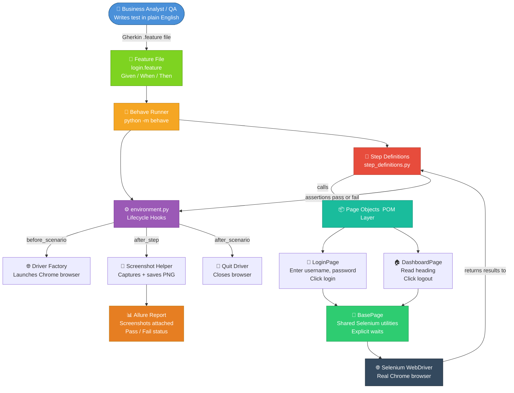
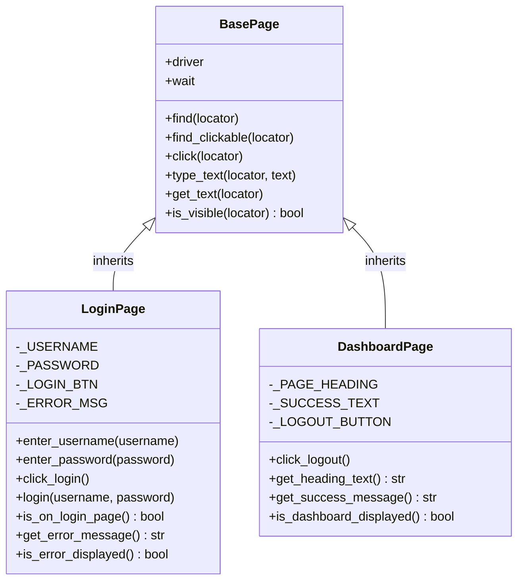
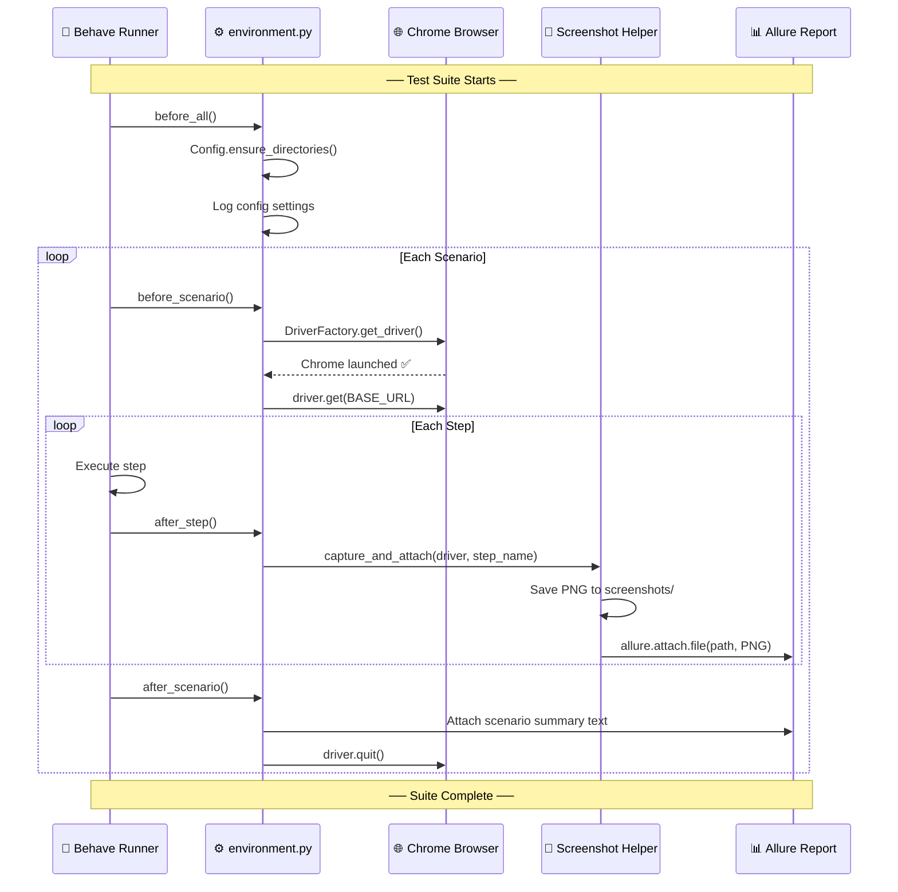
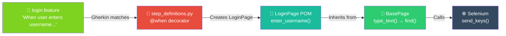
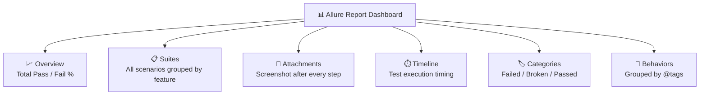
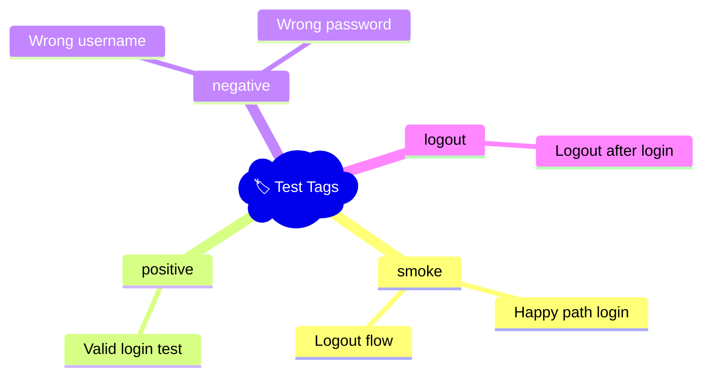
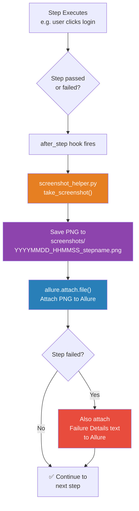

# 🏗️ Python BDD Framework — Project Architecture

> **Audience:** Everyone — Developers, QA Engineers, Business Analysts, and Managers.
> This document explains how the framework is built, how all the pieces connect, and how to run/view test results.

---

## 📌 What Does This Framework Do? (Plain English)

Think of this framework like an **automated quality inspector for a website**.

- 📋 **Business Analyst** writes test scenarios in plain English (e.g., *"When I log in with the wrong password, I should see an error"*)
- 🤖 **Framework** automatically opens a real browser, clicks buttons, fills forms, and checks results
- 📸 **Screenshot** is taken after *every single action* — pass or fail
- 📊 **Allure Report** collects everything and shows a beautiful dashboard with pass/fail status, screenshots, timings, and logs

---

## 🗺️ Big Picture — How It All Flows



---

## 📁 Full Project Structure — Annotated

```
d:\SamplePythonFrameWork\            ← 🏠 PROJECT ROOT
│
├── 📄 environment.py                ← ⚡ RUNNER HOOKS (before/after lifecycle)
├── 📄 behave.ini                    ← ⚙️  Behave configuration settings
├── 📄 requirements.txt              ← 📦 Python package dependencies
├── 📄 README.md                     ← 📖 Quick-start documentation
│
├── 📂 features/                     ← ✍️  TEST SCENARIOS (plain English)
│   ├── 📄 login.feature             ← Gherkin test scenarios
│   └── 📂 steps/
│       └── 📄 step_definitions.py   ← 🔗 BRIDGE: Gherkin → Python → POM
│
├── 📂 utils/                        ← 🛠️  FRAMEWORK UTILITIES
│   ├── 📄 config.py                 ← 🔧 All settings (URL, browser, timeouts)
│   ├── 📄 driver_factory.py         ← 🚗 Creates & configures the browser
│   ├── 📄 screenshot_helper.py      ← 📸 Captures screenshots, attaches to Allure
│   └── 📂 pages/                   ← 📦 PAGE OBJECT MODEL (POM)
│       ├── 📄 base_page.py          ← 🧱 Shared Selenium actions (click, type, wait)
│       ├── 📄 login_page.py         ← 🔑 Login page UI interactions
│       └── 📄 dashboard_page.py     ← 🏠 Dashboard page UI interactions
│
├── 📂 reports/                      ← 📊 ALLURE JSON results (auto-generated)
├── 📂 screenshots/                  ← 🖼️  PNG screenshots (auto-generated)
└── 📂 logs/                         ← 📋 Execution logs (auto-generated)
```

---

## 🧩 Layer-by-Layer Explanation

### Layer 1 — Feature Files (Business Layer)
> **Who writes it:** Business Analysts, Product Managers, QA Leads
> **Language:** Plain English (Gherkin)

```gherkin
# features/login.feature

Feature: User Login Functionality

  @smoke @positive
  Scenario: Successful login with valid credentials
    Given the user is on the login page
    When the user enters username "student" and password "Password123"
    And the user clicks the login button
    Then the user should be redirected to the dashboard
    And the dashboard should display a success message
```

**Rule:** No code here — only human-readable sentences.

---

### Layer 2 — Step Definitions (Bridge Layer)
> **Who writes it:** QA Automation Engineers
> **File:** `features/steps/step_definitions.py`

This is the **translator** — it connects plain English sentences to Python code.

```python
# Each @given/@when/@then matches EXACTLY one line in the feature file

@when('the user enters username "{username}" and password "{password}"')
def step_enter_credentials(context, username, password):
    page = LoginPage(context.driver)   # ← calls POM
    page.enter_username(username)
    page.enter_password(password)
```

**Rule:** Step definitions do NOT call Selenium directly. They call Page Objects.

---

### Layer 3 — Page Object Model / POM (UI Abstraction Layer)
> **Who writes it:** QA Automation Engineers
> **Folder:** `utils/pages/`

Each web page in the application gets its own Python class. This class **knows where the buttons are** and **how to interact with them**, but does NOT know about test logic.

```
BasePage  (shared utilities)
   ↓
LoginPage     — username field, password field, login button, error message
DashboardPage — page heading, success text, logout button
```



---

### Layer 4 — Hooks (Lifecycle Manager)
> **Who writes it:** QA Automation Engineers  
> **File:** `environment.py` ← **This is the runner control file**



---

### Layer 5 — Utilities
> **Folder:** `utils/`

| File | Purpose |
|------|---------|
| `config.py` | Central settings — URL, browser type, timeouts, folder paths |
| `driver_factory.py` | Creates Chrome / Firefox / Edge browser instances |
| `screenshot_helper.py` | Captures screenshots + attaches to Allure automatically |

---

## 🔌 How POM and Step Definitions Are Integrated



**In words:**
1. Feature file has a plain English step
2. Behave matches it to the `@when` function in `step_definitions.py`
3. Step definition creates a `LoginPage` object and calls `.enter_username()`
4. `LoginPage` inherits `type_text()` from `BasePage`
5. `BasePage.type_text()` calls Selenium's `send_keys()` on the real browser

---

## 🚀 Commands Reference Card

### ✅ Step 1 — Install Dependencies (One Time Only)
```powershell
pip install -r requirements.txt
```

### ✅ Step 2 — Run All Tests (with Allure output)
```powershell
python -m behave -f allure_behave.formatter:AllureFormatter -o reports/
```

### ✅ Step 3 — Open the Allure Report
```powershell
allure serve reports/
```
> 🌐 This opens a live HTML dashboard in your browser automatically.

---

### 🎯 Targeted Runs

| Goal | Command |
|------|---------|
| Run ALL tests | `python -m behave -f allure_behave.formatter:AllureFormatter -o reports/` |
| Run SMOKE tests only | `python -m behave -f allure_behave.formatter:AllureFormatter -o reports/ --tags=smoke` |
| Run NEGATIVE tests only | `python -m behave -f allure_behave.formatter:AllureFormatter -o reports/ --tags=negative` |
| Run LOGOUT test only | `python -m behave -f allure_behave.formatter:AllureFormatter -o reports/ --tags=logout` |
| Dry-run (check steps, no browser) | `python -m behave --dry-run` |
| Run WITHOUT Allure (console only) | `python -m behave` |
| Run headless (no visible browser) | `$env:HEADLESS="true"; python -m behave -f allure_behave.formatter:AllureFormatter -o reports/` |
| Use Firefox instead of Chrome | `$env:BROWSER="firefox"; python -m behave -f allure_behave.formatter:AllureFormatter -o reports/` |

---

## 📊 Allure Report — Configuration Guide

### How is Allure Configured?

Allure is configured in **three places**:

#### 1️⃣ The Run Command (formatter)
```powershell
# The "-f allure_behave.formatter:AllureFormatter" part tells Behave to write JSON
python -m behave -f allure_behave.formatter:AllureFormatter -o reports/
#                ↑ Allure formatter plugin                   ↑ Output folder
```

#### 2️⃣ In `environment.py` (screenshot attachment)
```python
# After every step, screenshots are automatically attached to Allure:
allure.attach.file(
    filepath,                          # path to the PNG file
    name=step_name,                    # label shown in Allure report
    attachment_type=allure.attachment_type.PNG
)
```

#### 3️⃣ In `step_definitions.py` (step decoration)
```python
@allure.step("When: Enter username and password")  # ← shows as step in Allure
def step_enter_credentials(context, username, password):
    ...

allure.attach(                         # ← attaches extra data inline
    "some text",
    name="Comparison",
    attachment_type=allure.attachment_type.TEXT,
)
```

### What Does the Allure Report Show?



### Installing Allure CLI (required to view reports)

**Option A — Scoop (Recommended for Windows)**
```powershell
# Install Scoop package manager (one-time setup)
Set-ExecutionPolicy -ExecutionPolicy RemoteSigned -Scope CurrentUser
irm get.scoop.sh | iex

# Install Allure
scoop install allure

# Verify
allure --version
```

**Option B — Manual Install**
1. Download from: https://github.com/allure-framework/allure2/releases
2. Extract the ZIP file
3. Add the `bin/` folder to your Windows PATH environment variable

**Then serve the report:**
```powershell
allure serve reports/
```

---

## ⚙️ Configuration — All Settings in One Place

> **File:** `utils/config.py`  
> Every setting can be overridden using **environment variables** — no code changes needed.

| Setting | Default Value | Override Variable | Description |
|---------|--------------|------------------|-------------|
| Application URL | `https://practicetestautomation.com/...` | `BASE_URL` | Website to test |
| Browser | `chrome` | `BROWSER` | `chrome`, `firefox`, `edge` |
| Headless mode | `false` | `HEADLESS` | `true` = no visible browser window |
| Implicit wait | `10` seconds | `IMPLICIT_WAIT` | How long to wait for elements |
| Explicit wait | `20` seconds | `EXPLICIT_WAIT` | Max wait for specific conditions |
| Page load timeout | `30` seconds | `PAGE_LOAD_TIMEOUT` | Max time for page to load |
| Test username | `student` | `TEST_USERNAME` | Login test credential |
| Test password | `Password123` | `TEST_PASSWORD` | Login test credential |

---

## 🏷️ Test Tags — What They Mean



| Tag | Which Scenarios | When to Use |
|-----|----------------|-------------|
| `@smoke` | Quick sanity check | After every deployment |
| `@positive` | Happy path | Full regression |
| `@negative` | Error handling | Full regression |
| `@logout` | Logout flow | Full regression |

---

## 📸 Screenshot Flow — How Every Step Gets Captured



---

## 🔄 Complete End-to-End Test Execution Flow

```mermaid
flowchart TD
    START(["▶️ Developer runs:\npython -m behave -f AllureFormatter -o reports/"])

    START --> BA["Behave reads\nbehave.ini config"]
    BA --> BB["Discovers\nfeatures/login.feature"]
    BB --> BC["Calls before_all hook\nCreate folders, log config"]

    BC --> SC1["── Scenario 1: Valid Login ──"]
    SC1 --> S1["before_scenario\nLaunch Chrome\nOpen BASE_URL"]
    S1 --> T1["Step: Given on login page"]
    T1 --> SS1["📸 Screenshot taken"]
    SS1 --> T2["Step: When enter credentials"]
    T2 --> SS2["📸 Screenshot taken"]
    SS2 --> T3["Step: When click login"]
    T3 --> SS3["📸 Screenshot taken"]
    SS3 --> T4["Step: Then on dashboard"]
    T4 --> SS4["📸 Screenshot taken"]
    SS4 --> T5["Step: Then success message"]
    T5 --> SS5["📸 Screenshot taken"]
    SS5 --> AS1["after_scenario\nQuit Chrome"]

    AS1 --> SC2["── Scenario 2: Invalid Username ──"]
    SC2 --> S2["before_scenario\nNew Chrome instance"]
    S2 --> MORE["... same flow ..."]
    MORE --> ASEND["after_scenario\nQuit Chrome"]

    ASEND --> RPT["📊 Allure JSON written\nto reports/ folder"]
    RPT --> END(["✅ Run complete!\nallure serve reports/\nOpens HTML dashboard"])

    style START fill:#2ECC71,color:#fff
    style END fill:#2ECC71,color:#fff
    style SS1 fill:#E67E22,color:#fff
    style SS2 fill:#E67E22,color:#fff
    style SS3 fill:#E67E22,color:#fff
    style SS4 fill:#E67E22,color:#fff
    style SS5 fill:#E67E22,color:#fff
    style RPT fill:#3498DB,color:#fff
```



---

## 🏁 Quick Start Checklist

```
□ 1. Install Python 3.11+
□ 2. Open terminal in: d:\SamplePythonFrameWork\
□ 3. Run: pip install -r requirements.txt
□ 4. Install Allure CLI (see above)
□ 5. Run tests:
       python -m behave -f allure_behave.formatter:AllureFormatter -o reports/
□ 6. View report:
       allure serve reports/
□ 7. Done! Browser opens with full test report 🎉
```

---

## 📞 Who Is Responsible for What?

| Role | Responsibility | Files They Touch |
|------|---------------|-----------------|
| **Business Analyst** | Write test scenarios in plain English | `features/*.feature` |
| **QA Engineer** | Write step definitions & page objects | `features/steps/*.py`, `utils/pages/*.py` |
| **Framework Engineer** | Maintain hooks, utilities, config | `environment.py`, `utils/config.py`, `utils/driver_factory.py` |
| **DevOps / CI** | Run tests in pipeline, store reports | Run commands, `reports/` output |

---

*📅 Last Updated: April 2026 | Framework: Behave + Selenium + Allure*
